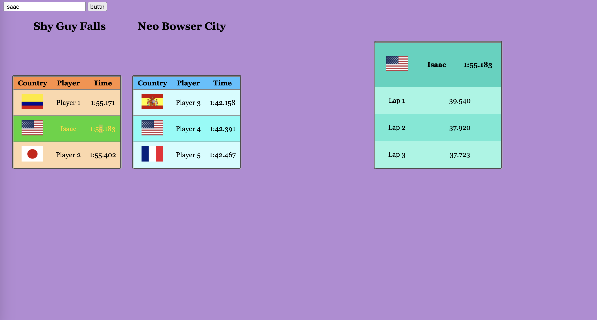

First Real Github Repo
======

### Introduction
This is a repo used to display my current progress on learning web dev, and this is also my first MD file.



These are the top three times on two tracks in Mario Kart 8 Deluxe (full leaderboards can be found at [MKLeaderboards](https://www.mkleaderboards.com/mk8dx)), you click on a player and it will show their splits for each lap on the specified track above. The button was used for an alert test with a greeting message containing whatever was inputed.

#### Strong practice with core language
This was completed using:

* Basic HTML
* CSS
* JavaScript

Just a fun little first project combining the usage of several languages.

###### JS Example

```js
for (const tr of trElems) {
    tr.addEventListener(
        "click",
        () => {
            const id = tr.getAttribute("mk-id")
            const playerData = data[id]

            if (!playerData) {
                return
            }

            updateDetails(playerData)
        }
    )
} 
```